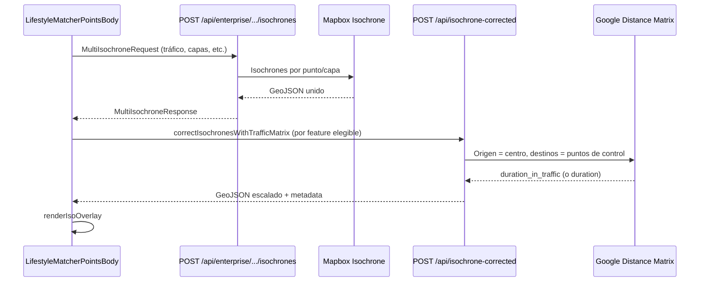

# Isochronas con tráfico y Google Distance Matrix

Este documento describe la **segunda fase** del flujo de isocronas en Lifestyle Matcher: la **corrección geométrica** usando la API **Distance Matrix** de Google cuando el usuario elige perfil **con tráfico**.

Para el flujo completo (Mapbox → backend → mapa), ver [`README-ISOCHRONES-LIFESTYLE.md`](./README-ISOCHRONES-LIFESTYLE.md).

---

## 1. Problema que resuelve

1. **Mapbox Isochrone** genera la isocrona en función del tiempo objetivo (minutos) y del modo de conducción, pero el modelo de **tráfico en tiempo real** no coincide necesariamente con lo que Google considera “tiempo con tráfico” en la zona.

2. Tras obtener la geometría desde `/api/enterprise/lifestyle-matcher/isochrones`, el frontend llama a un **post-proceso** que:
   - Toma muestras de **duración con tráfico** desde el centro hacia puntos de control sobre el borde de la isocrona.
   - Compara el **promedio** de esos tiempos con el **tiempo objetivo** configurado.
   - **Escala** la geometría (más grande o más pequeña) alrededor del centro para acercar la forma al tiempo deseado en condiciones actuales de tráfico.

No es un recálculo de ruta punto a punto: es un **ajuste de escala** de la polígono existente, acotado para evitar deformaciones extremas.

---

## 2. Flujo en dos pasos

1. **`createMultiIsochrone`** obtiene la isocrona “base” (Mapbox).
2. **`correctIsochronesWithTrafficMatrix`** (cliente) recorre cada `feature` y, solo si aplica, envía **una feature a la vez** a `/api/isochrone-corrected`.

Archivos:

| Rol | Archivo |
|-----|---------|
| Orquestación UI | `src/app/enterprise/lifestyle-matcher/puntos/components/LifestyleMatcherPointsBody.tsx` |
| Post-proceso cliente | `src/app/enterprise/lifestyle-matcher/puntos/services/isochroneCorrection.service.ts` |
| API corrección | `src/app/api/isochrone-corrected/route.ts` |

El **centro** para Matrix y para el escalado es el **promedio aritmético** de lat/lng de los puntos priorizados usados en la petición de isocrona.

---

## 3. Cuándo se aplica la corrección (frontend)

La función `correctIsochronesWithTrafficMatrix` solo modifica features que cumplen **todas** estas condiciones (`isochroneCorrection.service.ts`):

| Condición | Motivo |
|-----------|--------|
| `trafficProfile === "con-trafico"` | Sin tráfico no hay corrección Matrix. |
| `properties.contourParam === "contours_minutes"` | Solo capas de **tiempo** (minutos). |
| `properties.layerId !== "distance"` | La capa de **distancia** no se toca. |
| Modo **híbrido** (`hibrido`): solo `layerId === "time"`. | En híbrido, tiempo y distancia van en features separadas; solo se corrige **tiempo**. |
| Modo **calculada** (`calculada`): solo `layerId === "calculated"`. | Alineado con la capa “calculada con tráfico”. |
| Otros modos de contorno: típicamente `layerId === "time"`. | Coherencia con el resto de capas de minutos. |

Si la API devuelve error, geometría vacía o `metadata.fallback === true`, se **conserva la feature original** de Mapbox.

---

## 4. API `POST /api/isochrone-corrected`

### 4.1 Cuerpo (JSON)

| Campo | Tipo | Descripción |
|-------|------|-------------|
| `center` | `{ lat, lng }` | Centro de la isocrona (origen Matrix y pivote del escalado). |
| `target_time_minutes` | `number` | Minutos objetivo del contorno (debe coincidir con el valor usado en Mapbox para esa feature). |
| `mapbox_geojson` | `FeatureCollection` | GeoJSON con **Polygon** o **MultiPolygon** (normalmente **un feature** por llamada desde el servicio). |

### 4.2 Google Distance Matrix

- **URL:** `https://maps.googleapis.com/maps/api/distancematrix/json`
- **Origen:** un punto: `centerLat,centerLng`.
- **Destinos:** hasta 8 puntos de control en el **bounding box** de la geometría (N, S, E, O, esquinas), deduplicados y excluyendo el centro si coincide.
- **Parámetros relevantes:**

  | Parámetro | Valor | Efecto |
  |-----------|-------|--------|
  | `mode` | `driving` | Automóvil. |
  | `departure_time` | `now` | Permite que Google devuelva **`duration_in_traffic`** cuando aplica. |
  | `traffic_model` | `pessimistic` | Estimación conservadora de tráfico. |

- **Duración usada:** por cada destino, `duration_in_traffic.value` si existe; si no, `duration.value`. Se convierte a **minutos** y solo se usan elementos con `status === "OK"`.

### 4.3 Cálculo del factor de escala

1. `averageGoogleMinutes` = media de las duraciones (minutos) devueltas por Matrix.
2. `rawFactor = target_time_minutes / averageGoogleMinutes`
3. `scaleFactor = clamp(rawFactor, 0.55, 1.7)` — límites `MIN_SCALE_FACTOR` / `MAX_SCALE_FACTOR` en el route.
4. La geometría se transforma con **Turf** `transformScale` respecto al origen `[centerLng, centerLat]` (orden lon/lat GeoJSON).

Interpretación:

- Si el tráfico real hace que los bordes sean **más lentos** de lo esperado (promedio Google mayor que el objetivo), el factor suele ser **menor que 1** y la forma **se encoge**.
- Si es **más rápido**, el factor es **mayor que 1** y la forma **crece**.

### 4.4 Respuesta exitosa

Incluye `corrected_geojson` (FeatureCollection) y `metadata` con campos como:

- `original_time`, `google_avg_time`, `scale_factor`
- `explanation` (texto legible: expandir/contraer/sin cambio)
- `fallback: false`, `samples_used`

### 4.5 Fallbacks (se devuelve la geometría de entrada sin cambio o vacío según caso)

- Payload inválido o centro fuera de rango.
- **Sin API key** (ver sección 5).
- Sin puntos de control válidos.
- Error HTTP o `status !== OK` de Google.
- Sin duraciones útiles.
- **Rate limit** (429) cuando Redis está activo: cuerpo con `metadata.reason === "rate-limit"` y cabecera `Retry-After`.
- Error inesperado en el route: respuesta defensiva con `features: []` y `fallback: true`.

En todos los fallbacks “suaves”, `metadata.fallback: true` y la UI puede seguir mostrando la isocrona Mapbox sin corrección.

---

## 5. Variables de entorno (clave Matrix)

El backend toma la primera clave disponible, en este orden:

1. `GOOGLE_DISTANCE_MATRIX_API_KEY` (recomendada para este uso)
2. `GOOGLE_MAPS_API_KEY_SERVER`
3. `GOOGLE_MAPS_API_KEY`
4. `NEXT_PUBLIC_GOOGLE_MAPS_API_KEY`

En producción conviene una clave con **Distance Matrix API** habilitada y restricciones acordes (IP del servidor, etc.).

---

## 6. Rate limiting

Si existen `REDIS_URL` y la configuración de rate limit (`ISO_RATE_LIMIT_*`, `getIsoRateLimitConfig`), el route `/api/isochrone-corrected` puede limitar por IP. Detalles: `src/lib/rateLimit.ts` y sección 27 de `README-AGENTE.md`.

---

## 7. Pruebas

- API: `tests/api/isochrone-corrected.test.ts`
- Servicio: `tests/services/isochroneCorrection.service.test.ts` (p. ej. en híbrido solo se corrige la capa `time`, no `distance`)

---

## 8. Resumen

| Aspecto | Comportamiento |
|---------|----------------|
| Generación base | Mapbox Isochrone vía `/api/enterprise/lifestyle-matcher/isochrones` |
| Tráfico “real” | Google Distance Matrix: `departure_time=now` + `duration_in_traffic` |
| Ajuste | Escalado homogéneo de polígono con Turf alrededor del centro |
| Capas | Solo tiempo en minutos; **nunca** la capa de distancia en modo híbrido |
| Degradación | Sin key o error Google → isocrona Mapbox sin modificar |
