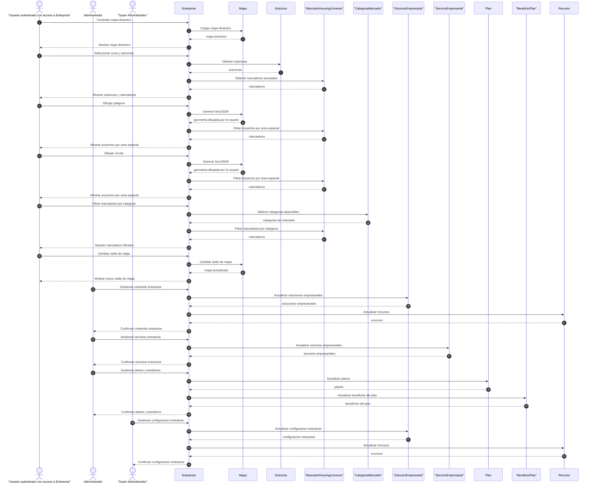

# Completo UML Enterprise

```mermaid
sequenceDiagram
    autonumber

    actor UsuarioEnterprise as "Usuario autenticado con acceso a Enterprise"
    actor Administrador
    actor SuperAdministrador as "Super Administrador"

    participant Enterprise
    participant Mapa as Mapa
    participant Subzona
    participant MarcadorHousingUniverse as "MarcadorHousingUniverse"
    participant CategoriaMarcador as "CategoriaMarcador"
    participant SolucionEmpresarial as "SolucionEmpresarial"
    participant ServicioEmpresarial as "ServicioEmpresarial"
    participant Plan
    participant BeneficioPlan as "BeneficioPlan"
    participant Recurso

    UsuarioEnterprise ->> Enterprise: Consultar mapa dinamico
    Enterprise ->> Mapa: Cargar mapa dinamico
    Mapa -->> Enterprise: mapa dinamico
    Enterprise -->> UsuarioEnterprise: Mostrar mapa dinamico

    UsuarioEnterprise ->> Enterprise: Seleccionar zona y subzonas
    Enterprise ->> Subzona: Obtener subzonas
    Subzona -->> Enterprise: subzonas
    Enterprise ->> MarcadorHousingUniverse: Obtener marcadores asociados
    MarcadorHousingUniverse -->> Enterprise: marcadores
    Enterprise -->> UsuarioEnterprise: Mostrar subzonas y marcadores

    UsuarioEnterprise ->> Enterprise: Dibujar poligono
    Enterprise ->> Mapa: Generar GeoJSON
    Mapa -->> Enterprise: geometria dibujada por el usuario
    Enterprise ->> MarcadorHousingUniverse: Filtrar proyectos por area espacial
    MarcadorHousingUniverse -->> Enterprise: marcadores
    Enterprise -->> UsuarioEnterprise: Mostrar proyectos por area espacial

    UsuarioEnterprise ->> Enterprise: Dibujar circulo
    Enterprise ->> Mapa: Generar GeoJSON
    Mapa -->> Enterprise: geometria dibujada por el usuario
    Enterprise ->> MarcadorHousingUniverse: Filtrar proyectos por area espacial
    MarcadorHousingUniverse -->> Enterprise: marcadores
    Enterprise -->> UsuarioEnterprise: Mostrar proyectos por area espacial

    UsuarioEnterprise ->> Enterprise: Filtrar marcadores por categoria
    Enterprise ->> CategoriaMarcador: Obtener categorias disponibles
    CategoriaMarcador -->> Enterprise: categorias de marcador
    Enterprise ->> MarcadorHousingUniverse: Filtrar marcadores por categoria
    MarcadorHousingUniverse -->> Enterprise: marcadores
    Enterprise -->> UsuarioEnterprise: Mostrar marcadores filtrados

    UsuarioEnterprise ->> Enterprise: Cambiar estilo de mapa
    Enterprise ->> Mapa: Cambiar estilo de mapa
    Mapa -->> Enterprise: mapa actualizado
    Enterprise -->> UsuarioEnterprise: Mostrar nuevo estilo de mapa

    Administrador ->> Enterprise: Gestionar contenido enterprise
    Enterprise ->> SolucionEmpresarial: Actualizar soluciones empresariales
    SolucionEmpresarial -->> Enterprise: soluciones empresariales
    Enterprise ->> Recurso: Actualizar recursos
    Recurso -->> Enterprise: recursos
    Enterprise -->> Administrador: Confirmar contenido enterprise

    Administrador ->> Enterprise: Gestionar servicios enterprise
    Enterprise ->> ServicioEmpresarial: Actualizar servicios empresariales
    ServicioEmpresarial -->> Enterprise: servicios empresariales
    Enterprise -->> Administrador: Confirmar servicios enterprise

    Administrador ->> Enterprise: Gestionar planes y beneficios
    Enterprise ->> Plan: Actualizar planes
    Plan -->> Enterprise: planes
    Enterprise ->> BeneficioPlan: Actualizar beneficios del plan
    BeneficioPlan -->> Enterprise: beneficios del plan
    Enterprise -->> Administrador: Confirmar planes y beneficios

    SuperAdministrador ->> Enterprise: Gestionar configuracion enterprise
    Enterprise ->> SolucionEmpresarial: Actualizar configuracion enterprise
    SolucionEmpresarial -->> Enterprise: configuracion enterprise
    Enterprise ->> Recurso: Actualizar recursos
    Recurso -->> Enterprise: recursos
    Enterprise -->> SuperAdministrador: Confirmar configuracion enterprise
```
