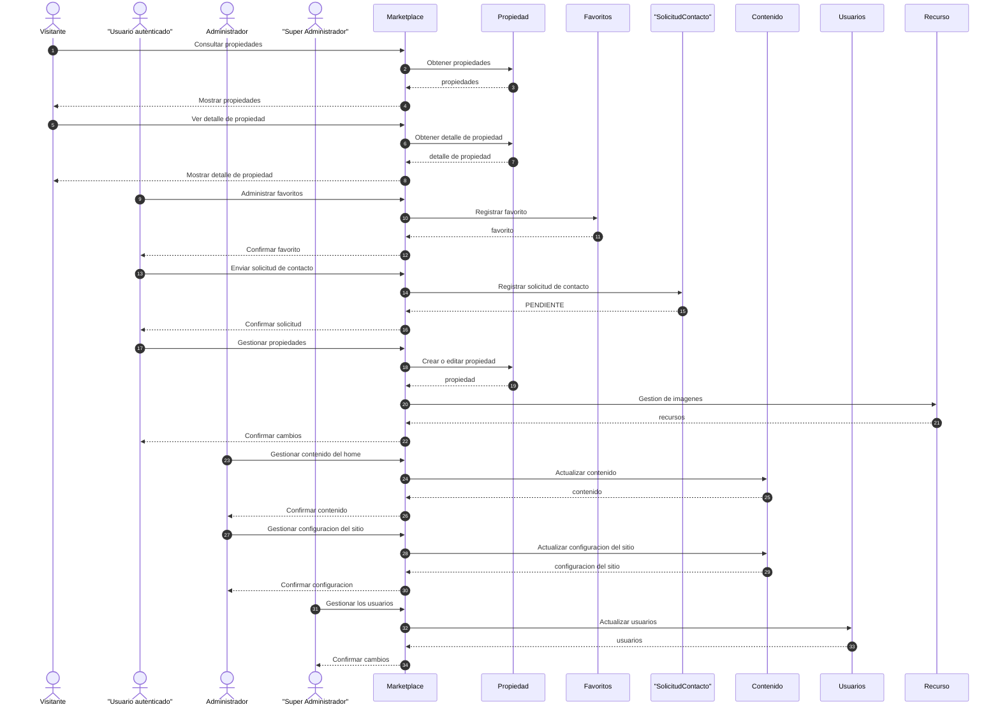

# Completo UML Marketplace

```mermaid
sequenceDiagram
    autonumber

    actor Visitante
    actor UsuarioAutenticado as "Usuario autenticado"
    actor Administrador
    actor SuperAdministrador as "Super Administrador"

    participant Marketplace
    participant Propiedad
    participant Favoritos
    participant SolicitudContacto as "SolicitudContacto"
    participant Contenido
    participant Usuarios
    participant Recurso

    Visitante ->> Marketplace: Consultar propiedades
    Marketplace ->> Propiedad: Obtener propiedades
    Propiedad -->> Marketplace: propiedades
    Marketplace -->> Visitante: Mostrar propiedades

    Visitante ->> Marketplace: Ver detalle de propiedad
    Marketplace ->> Propiedad: Obtener detalle de propiedad
    Propiedad -->> Marketplace: detalle de propiedad
    Marketplace -->> Visitante: Mostrar detalle de propiedad

    UsuarioAutenticado ->> Marketplace: Administrar favoritos
    Marketplace ->> Favoritos: Registrar favorito
    Favoritos -->> Marketplace: favorito
    Marketplace -->> UsuarioAutenticado: Confirmar favorito

    UsuarioAutenticado ->> Marketplace: Enviar solicitud de contacto
    Marketplace ->> SolicitudContacto: Registrar solicitud de contacto
    SolicitudContacto -->> Marketplace: PENDIENTE
    Marketplace -->> UsuarioAutenticado: Confirmar solicitud

    UsuarioAutenticado ->> Marketplace: Gestionar propiedades
    Marketplace ->> Propiedad: Crear o editar propiedad
    Propiedad -->> Marketplace: propiedad
    Marketplace ->> Recurso: Gestion de imagenes
    Recurso -->> Marketplace: recursos
    Marketplace -->> UsuarioAutenticado: Confirmar cambios

    Administrador ->> Marketplace: Gestionar contenido del home
    Marketplace ->> Contenido: Actualizar contenido
    Contenido -->> Marketplace: contenido
    Marketplace -->> Administrador: Confirmar contenido

    Administrador ->> Marketplace: Gestionar configuracion del sitio
    Marketplace ->> Contenido: Actualizar configuracion del sitio
    Contenido -->> Marketplace: configuracion del sitio
    Marketplace -->> Administrador: Confirmar configuracion

    SuperAdministrador ->> Marketplace: Gestionar los usuarios
    Marketplace ->> Usuarios: Actualizar usuarios
    Usuarios -->> Marketplace: usuarios
    Marketplace -->> SuperAdministrador: Confirmar cambios
```
